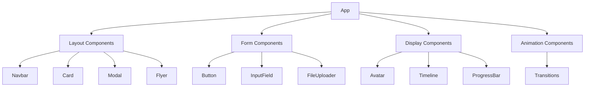

# System Patterns: Svelte UI Library

## Architecture Overview

- Component-based architecture
- Isolated component styles
- Props-driven configuration
- Theme provider pattern

## Key Component Relationships

## Design Patterns

1. **Props Pattern**

   - Each component has props.ts
   - Strictly typed interfaces
   - Default values defined

2. **Styling Approach**

   - CSS variables for theming
   - Scoped styles per component
   - Two theme options (default/improved)

3. **Composition Pattern**

   - Complex components built from simples ones
   - Example: Navbar uses NavMenu
   - Example: Card uses Button

4. **Semantic Navigation Pattern**

   - Navbar and NavMenu use semantic `nav` elements
   - Navigation items use `button` elements
   - ARIA labels for screen reader support
   - Keyboard navigation support

5. **Transitions System**

   - Centralized transition definitions
   - Type-safe transition configurations
   - Reusable animation patterns
   - Supports custom easing functions
   - Accessibility considerations for motion

6. **Flyer Component Pattern**
   - Props-driven configuration
   - Supports multiple content types
   - Responsive layout behavior
   - Accessible focus management

## Data Flow

- Parent to child via props
- No global state management
- Event dispatch for interactions

Last Updated: 4/1/2025
