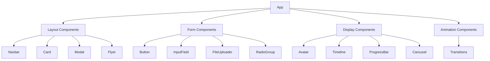

# System Patterns: Svelte UI Library

## Architecture Overview

- Component-based architecture
- Isolated component styles
- Props-driven configuration
- Theme provider pattern

## Key Component Relationships

## Design Patterns

1. **Props Pattern**
   - Each component has props.ts
   - Strictly typed interfaces
   - Default values defined

2. **Styling Approach**
   - CSS variables for theming
   - Scoped styles per component
   - Two theme options (default/improved)

3. **Composition Pattern**
   - Complex components built from simples ones
   - Example: Navbar uses NavMenu
   - Example: Card uses Button

4. **Semantic Navigation Pattern**
   - Navbar and NavMenu use semantic `nav` elements
   - Navigation items use `button` elements
   - ARIA labels for screen reader support
   - Keyboard navigation support

5. **Transitions System**
   - Centralized transition definitions
   - Type-safe transition configurations
   - Reusable animation patterns
   - Supports custom easing functions
   - Accessibility considerations for motion

6. **Flyer Component Pattern**
   - Props-driven configuration
   - Supports multiple content types
   - Responsive layout behavior
   - Accessible focus management

7. **Carousel Component Pattern**
   - Props-driven configuration for navigation and animation.
   - `buttonConfig` object controls button visibility, position, and keyboard control.
   - `disableAnimation` boolean prop to enable/disable all animations.
   - Supports keyboard navigation with arrow keys.

8. **RadioGroup Component Pattern**
   - Props-driven configuration for options, selected value, and name.
   - `disableAnimation` boolean prop to enable/disable all animations.
   - Fully themed via centralized CSS variables in `improved-theme.css`.
   - Subtle animations on selection.
   - Hover and focus states for improved user experience.

9. **Recursive SideNav Pattern**
   - `SideNav.svelte` acts as the main container.
   - `SideNavItem.svelte` is a recursive component that can render itself for nested items.
   - Data is passed via an `items` prop, which is an array of `NavItem` objects.
   - Supports infinite nesting of navigation items.
   - Uses Svelte's `slide` transition for smooth animations.

## Data Flow

- Parent to child via props
- No global state management
- Event dispatch for interactions

Last Updated: 6/9/2025
