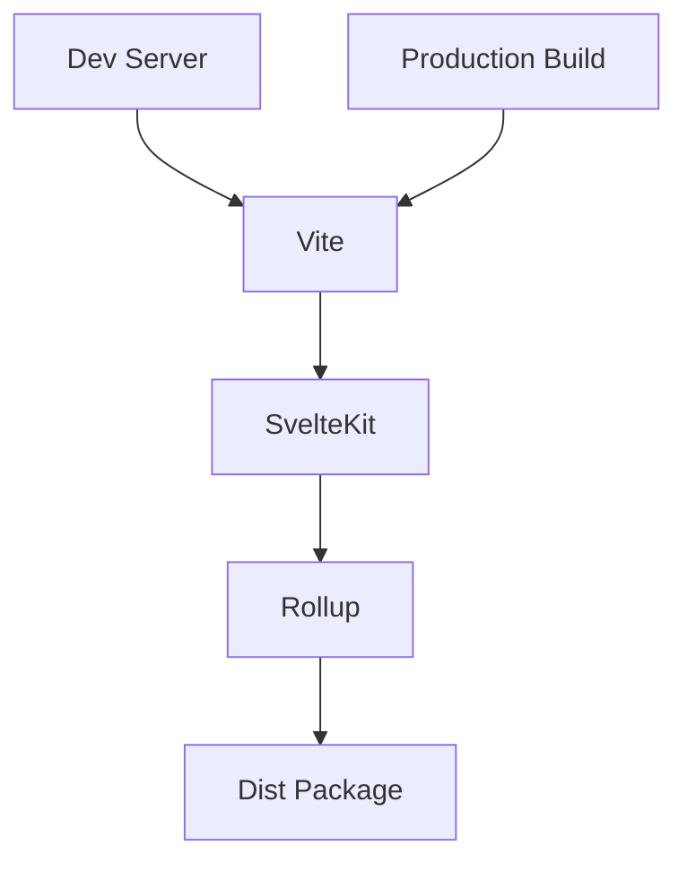

# Technical Context: Svelte UI Library

## Core Technologies

- **Svelte**: 4.2.19 (Component framework)
- **TypeScript**: 5.0.0 (Static typing)
- **Vite**: 5.0.3 (Build tool)
- **SvelteKit**: 2.0.0 (Application framework)
- **Transitions**: 1.0.0 (Animation system)

## Build System

## Key Dependencies

1. **Development**

   - @sveltejs/package: 2.2.2 (Component packaging)
   - svelte-check: 4.0.0 (Type checking)
   - prettier: Formatting

2. **Runtime**
   - prismjs: 1.29.0 (Syntax highlighting)
   - tslib: 2.8.1 (TypeScript helpers)

## Development Setup

- ES Modules (type: "module")
- Port 5174 for dev server
- Husky for git hooks
- Prettier for formatting

## Accessibility Improvements

1. **Navigation Components**

   - Semantic `nav` elements implemented
   - ARIA labels for screen readers
   - Keyboard navigation support
   - Button elements for interactive items
   - Focus states for keyboard users

2. **Best Practices**
   - Removed svelte-ignore comments
   - Added proper ARIA attributes
   - Maintained existing functionality

## Tooling

- Vite: Dev server and bundler
- Rollup: Production bundling
- SvelteKit: Routing and SSR
- TypeScript: Type checking

Last Updated: 4/1/2025
